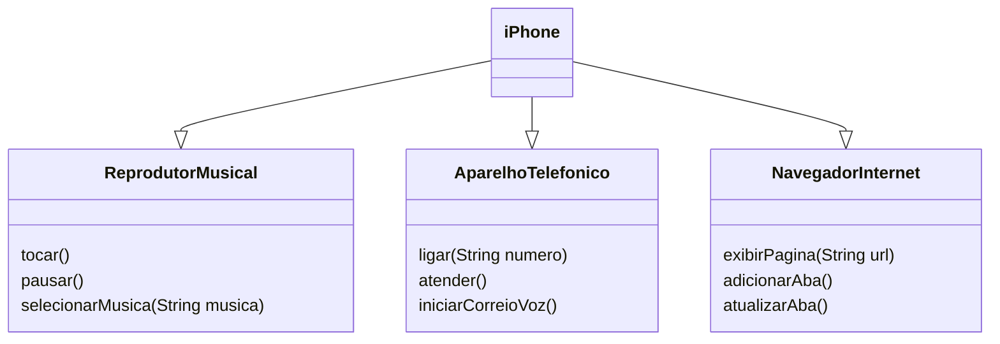

## Solução do Desafio
- Interfaces: Definem os métodos que devem ser implementados pelas classes que as utilizam.

- Classe iPhone: Implementa as três interfaces e define o comportamento dos métodos.

- Métodos: Cada método de cada interface foi implementado para representar as funcionalidades básicas do iPhone como reprodutor de música, telefone e navegador.



## Implementações em Código

### Interfaces 

```java
public interface ReprodutorMusical {
    void tocar();
    void pausar();
    void selecionarMusica(String musica);
}
```

```java
public interface AparelhoTelefonico {
    void ligar(String numero);
    void atender();
    void iniciarCorreioVoz();
}
```

```java
public interface NavegadorInternet {
    void exibirPagina(String url);
    void adicionarNovaAba();
    void atualizarPagina();
}
```

### iPhone
```java
public class iPhone implements ReprodutorMusical, AparelhoTelefonico, NavegadorInternet {

    // Implementação dos métodos de ReprodutorMusical
    @Override
    public void tocar() {
        System.out.println("Reproduzindo música...");
    }

    @Override
    public void pausar() {
        System.out.println("Música pausada.");
    }

    @Override
    public void selecionarMusica(String musica) {
        System.out.println("Música selecionada: " + musica);
    }

    // Implementação dos métodos de AparelhoTelefonico
    @Override
    public void ligar(String numero) {
        System.out.println("Ligando para: " + numero);
    }

    @Override
    public void atender() {
        System.out.println("Atendendo chamada...");
    }

    @Override
    public void iniciarCorreioVoz() {
        System.out.println("Iniciando correio de voz...");
    }

    // Implementação dos métodos de NavegadorInternet
    @Override
    public void exibirPagina(String url) {
        System.out.println("Exibindo página: " + url);
    }

    @Override
    public void adicionarNovaAba() {
        System.out.println("Nova aba adicionada.");
    }

    @Override
    public void atualizarPagina() {
        System.out.println("Página atualizada.");
    }

    public static void main(String[] args) {
        iPhone meuIphone = new iPhone();

        // Testando Reprodutor Musical
        meuIphone.tocar();
        meuIphone.selecionarMusica("Favorite Song");
        meuIphone.pausar();

        // Testando Aparelho Telefônico
        meuIphone.ligar("123456789");
        meuIphone.atender();
        meuIphone.iniciarCorreioVoz();

        // Testando Navegador de Internet
        meuIphone.exibirPagina("https://www.example.com");
        meuIphone.adicionarNovaAba();
        meuIphone.atualizarPagina();
    }
}
```